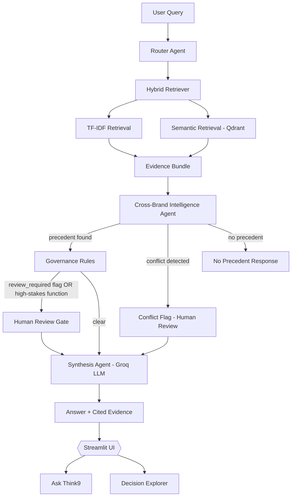

# 🧠 Think9 Decision Intelligence OS

> _"Has Think9 already learned this somewhere else?"_

An agentic decision-intelligence layer, centrally deployable across Think9's 30+ brand portfolio — built to eliminate a real operational bottleneck: **repeated mistakes and re-litigated decisions caused by no shared institutional memory across brands.**

Not a per-brand document chatbot. A structured decision archive with cross-brand precedent discovery, conflict detection, and governance gates — deterministic where it must be, LLM-powered only where reasoning genuinely adds value.

---

## The Problem

Think9 operates 30+ consumer brands, each making independent decisions on suppliers, claims, launches, and strategy — with no mechanism to ask **"has another brand already been through this?"** Today, that answer either doesn't exist, or requires manual tribal-knowledge archaeology (Slack, old decks, asking around) across a portfolio too large for anyone to hold in their head.

**Cost of the gap:** repeated supplier failures, re-approved claims that already caused issues elsewhere, launch strategies re-tried without knowing they previously conflicted across brands.

## The Solution

A centralized decision archive + agentic reasoning pipeline that:

- Surfaces relevant precedent from **any** brand, not just the one asking
- Flags **conflicting** outcomes across brands instead of forcing a false-confident single verdict
- Routes high-stakes or evidence-flagged answers to **human review** automatically
- Never fabricates a confidence percentage — cites decision/document IDs instead

---

## Architecture



**Design principle:** everything upstream of Synthesis (retrieval, routing, conflict detection, governance) is **deterministic on purpose** — an LLM failure or hallucination can't corrupt which evidence was actually found or whether a conflict/review flag fires. The LLM is used only for the final natural-language synthesis step, always grounded in evidence it's handed, never for deciding _what counts as relevant_.

---

## Agent Pipeline

| Stage                        | Type                                  | Responsibility                                                                                   |
| ---------------------------- | ------------------------------------- | ------------------------------------------------------------------------------------------------ |
| **Router**                   | Deterministic                         | Classifies query by business function (legal, procurement, marketing, etc.)                      |
| **Hybrid Retriever**         | Deterministic                         | TF-IDF + semantic (Qdrant) retrieval over decisions + documents                                  |
| **Cross-Brand Intelligence** | Deterministic                         | Classifies precedent as clear / conflicting / absent across brands                               |
| **Governance**               | Deterministic                         | Flags human review based on evidence-level flags + high-stakes function rules                    |
| **Synthesis**                | LLM (Groq, `llama-3.3-70b-versatile`) | Generates final grounded answer, citing decision/document IDs — never a numeric confidence score |

---

## Tech Stack

- **Orchestration:** LangGraph
- **LLM:** Groq (`llama-3.3-70b-versatile`) — free tier, OpenAI-compatible
- **Retrieval:** TF-IDF (scikit-learn) + semantic embeddings via Qdrant, compared head-to-head in eval
- **UI:** Streamlit (multipage — Ask Think9 + Decision Explorer)
- **Testing:** pytest (21 tests) + custom eval harness against 7 labeled queries

---

## Folder Structure

```
Think9-Decision_IntelligenceOS/
├── apps/
│   ├── __init__.py
│   ├── streamlit_app.py            # Landing page
│   ├── resources.py                # Cached pipeline loader
│   ├── styles.py                   # Shared CSS
│   └── pages/
│       ├── 1_Ask_think9.py         # Q&A interface
│       └── 2_Decision_Explorer.py  # Browse by supplier/brand
├── src/
│   ├── agents/
│   │   ├── router.py                # Query classification
│   │   ├── cross_brand_agent.py     # Precedent/conflict classification
│   │   └── synthesis_agent.py       # LLM answer generation
│   ├── governance/
│   │   └── rules.py                 # Human-review trigger rules
│   ├── graph/
│   │   └── pipeline.py              # LangGraph orchestration
│   ├── ingestion/
│   │   ├── loader.py                # Corpus loading
│   │   ├── embed.py                 # TF-IDF embedding
│   │   ├── semantic_embed.py        # Semantic embedding
│   │   └── validator.py             # Corpus validation
│   ├── retrieval/
│   │   ├── decision_retriever.py
│   │   ├── hybrid_retriever.py
│   │   ├── vector_store.py
│   │   └── qdrant_store.py
│   └── schemas/
│       ├── decision.py
│       ├── document.py
│       └── evaluation.py
├── data/
│   ├── decisions.json
│   ├── documents.json
│   └── evaluation_queries.json
├── eval/
│   ├── run_agent_eval.py
│   ├── run_comparision.py
│   ├── run_eval.py
│   └── metrics.py
├── tests/
│   ├── test_governance.py
│   ├── test_retrieval.py
│   └── test_semantic_retrieval.py
├── docs/
│   ├── ARCHITECTURE.md
│   └── 30-day-roadmap.md
├── .env.example
├── .gitignore
├── requirements.txt
└── README.md
```

---

## Quickstart

```bash
git clone <repo-url>
cd Think9-Decision_IntelligenceOS
python -m venv venv
venv\Scripts\activate          # Windows
pip install -r requirements.txt

# Add your Groq API key (free tier, no card required)
copy .env.example .env
# edit .env → GROQ_API_KEY=gsk_...

python -m pytest tests/ -v      # confirm 21 passed
streamlit run app/streamlit_app.py
```

Open `http://localhost:8501`. Use the sidebar to switch between **Ask Think9** and **Decision Explorer**.

---

## Example Queries

- _"We're evaluating Supplier Alpha for packaging on a new sunscreen SKU. What should we know?"_ — cross-brand precedent
- _"Should we bring Supplier Alpha onto Lumen given how it's performed elsewhere?"_ — conflicting precedent, triggers human review
- _"Have we ever worked with a supplier called Delta on cold-chain logistics?"_ — no precedent found (honesty test)

---

## What's Real MVP vs. Roadmap

This is a working prototype on a **synthetic corpus** (18 decisions, 28 documents, 5 fictional brands) built to demonstrate the architecture and reasoning pattern. See [`docs/ARCHITECTURE.md`](docs/ARCHITECTURE.md) and [`docs/30-day-roadmap.md`](docs/30-day-roadmap.md) for exactly what's production-real today versus what a real deployment across Think9's actual 30+ brand data would require.

---

## Evaluation

Ran against 7 labeled queries spanning clear precedent, conflicting precedent, and no-precedent cases, comparing TF-IDF vs. semantic retrieval. See eval results and findings in `docs/ARCHITECTURE.md`.

```bash
python eval/run_agent_eval.py
```

---

Built for the Think9 Consumer AI & Data Science Intern take-home challenge.
