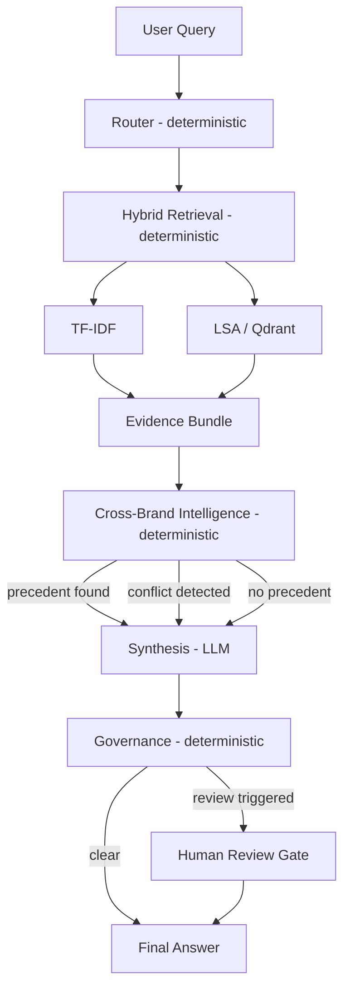

# 🧠 Think9 Decision Intelligence OS

> _"Has Think9 already learned this somewhere else?"_

An agentic decision-intelligence layer, centrally deployable across Think9's 30+ brand portfolio — built to eliminate a real operational bottleneck: **repeated mistakes and re-litigated decisions caused by no shared institutional memory across brands.**

Not a per-brand document chatbot. A structured decision archive with cross-brand precedent discovery, conflict detection, and governance gates — deterministic where correctness matters, LLM-powered only for final language synthesis.

**Live demo:** https://think9-decision-intelligence-os.streamlit.app/

---

## The Problem

Think9 operates 30+ consumer brands, each making independent decisions on suppliers, product claims, and launch strategy — with no mechanism to ask **"has another brand already been through this?"** Today, that answer either doesn't exist, or requires manual tribal-knowledge archaeology (Slack, old decks, asking around) across a portfolio too large for anyone to hold in their head.

**Cost of the gap:** repeated supplier failures, re-approved claims that already caused issues elsewhere, launch strategies re-tried without knowing they previously conflicted across brands.

## The Solution

A centralized decision archive + agentic reasoning pipeline that:

- Surfaces relevant precedent from **any** brand, not just the one asking
- Flags **conflicting** outcomes across brands instead of forcing a false-confident single verdict
- Routes high-stakes or evidence-flagged answers to **human review** automatically
- Grounds every synthesized claim in actual retrieved decision and document content — never a fabricated confidence score

## Key Differentiator

| Generic RAG chatbot                                      | This system                                                                                                                                                                                    |
| -------------------------------------------------------- | ---------------------------------------------------------------------------------------------------------------------------------------------------------------------------------------------- |
| Retrieves text, answers from it                          | Retrieves **structured decisions**, reasons over their outcomes                                                                                                                                |
| One brand's documents at a time                          | **Cross-brand** precedent by design                                                                                                                                                            |
| Confident-sounding answer regardless of evidence quality | Explicitly **abstains** when evidence is weak, **flags conflicts** instead of forcing a verdict                                                                                                |
| LLM decides what's relevant                              | LLM only writes the final answer — routing, retrieval, conflict detection, and governance are **deterministic**, so an LLM error can't corrupt what evidence was found or whether a flag fires |

---

## Architecture



**Why deterministic components surround the LLM:** the LLM is used for language generation and nuanced synthesis, never for authoritative evidence selection or governance decisions. See [`docs/ARCHITECTURE.md`](docs/ARCHITECTURE.md) for the full rationale.

---

## Tech Stack

- **Orchestration:** LangGraph — `retrieve → route → cross_brand → governance → synthesize`
- **LLM:** Groq (`llama-3.3-70b-versatile`) — free tier, OpenAI-compatible. Synthesis is explicitly grounded: the prompt includes actual retrieved decision and document content, and the model is instructed never to cite an ID it wasn't given.
- **Retrieval:** TF-IDF (scikit-learn) is the production default in the deployed app. An LSA-based retriever (TF-IDF → Truncated SVD, stored in Qdrant embedded mode) is implemented and benchmarked head-to-head in eval — **not** a transformer embedding (this sandbox's network blocks huggingface.co) — and was deliberately not made the production default because it produced more false positives on no-precedent queries. See `src/ingestion/semantic_embed.py` and the Evaluation section below.
- **UI:** Streamlit (multipage — Ask Think9 + Decision Explorer), with LLM/user-influenced output HTML-escaped before rendering.
- **Testing:** pytest, 21 tests, all passing — schemas, retrieval (TF-IDF + LSA), governance (all 3 trigger rules).

---

## Repository Structure

```
Think9-Decision_IntelligenceOS/
├── apps/
│   ├── streamlit_app.py            # Landing page
│   ├── resources.py                # Cached pipeline loader (TF-IDF only, production)
│   ├── styles.py                   # Shared CSS
│   └── pages/
│       ├── 1_Ask_think9.py         # Q&A interface
│       └── 2_Decision_Explorer.py  # Browse by supplier/brand
├── src/
│   ├── agents/
│   │   ├── router.py                # Query classification (deterministic, post-retrieval label)
│   │   ├── cross_brand_agent.py     # Precedent/conflict classification (deterministic)
│   │   └── synthesis_agent.py       # LLM answer generation (only LLM step, evidence-grounded)
│   ├── governance/
│   │   └── rules.py                 # Human-review trigger rules (deterministic, 3 triggers)
│   ├── graph/
│   │   └── pipeline.py              # LangGraph orchestration
│   ├── ingestion/
│   │   ├── loader.py                # Corpus loading
│   │   ├── embed.py                 # TF-IDF embedding
│   │   ├── semantic_embed.py        # LSA embedding
│   │   └── validator.py             # Corpus validation
│   ├── retrieval/
│   │   ├── decision_retriever.py
│   │   ├── hybrid_retriever.py
│   │   ├── vector_store.py
│   │   └── qdrant_store.py
│   └── schemas/
│       ├── decision.py
│       ├── document.py
│       └── evaluation.py
├── data/                            # Synthetic corpus: 18 decisions, 28 documents, 5 brands
├── eval/
│   ├── run_agent_eval.py           # Full pipeline: agent behavior vs. ground truth
│   ├── run_eval.py                 # Retrieval-only: recall@6, false-positive rate
│   ├── run_comparision.py          # TF-IDF vs. LSA retrieval, head-to-head
│   └── metrics.py
├── tests/                           # 21 tests: schemas, retrieval, governance
├── docs/
│   ├── ARCHITECTURE.md
│   ├── 30-day-roadmap.md
│   └── demo-script.md
├── .env.example
├── .gitignore
├── requirements.txt
└── README.md
```

---

## Setup

```bash
# 1. Clone
git clone https://github.com/9raveen/Think9-Decision-Intelligence-OS.git
cd Think9-Decision_IntelligenceOS

# 2. Create environment
python -m venv venv
venv\Scripts\activate          # Windows

# 3. Install dependencies
pip install -r requirements.txt

# 4. Configure .env
copy .env.example .env
# edit .env → GROQ_API_KEY=gsk_your_key   (free tier, console.groq.com, no card required)

# 5. Run tests
python -m pytest tests/ -v      # 21 passed

# 6. Run evaluation
python eval/run_agent_eval.py
python eval/run_eval.py
python eval/run_comparision.py

# 7. Launch Streamlit
streamlit run apps/streamlit_app.py
```

Without `GROQ_API_KEY` set, the app still runs — `synthesis_agent.py` falls back to a deterministic template answer, clearly labeled in the UI as a fallback.

---

## Example Query

**Input:** _"We're evaluating Supplier Alpha for packaging on a new sunscreen SKU. What should we know?"_

**Behavior:** Retrieves Nova's prior Alpha/PET packaging history, cites the specific decision and document IDs it was actually given (never an invented ID), and states explicitly if evidence is mixed rather than declaring Alpha universally good or bad.

More scenarios in [`docs/demo-script.md`](docs/demo-script.md).

---

## Evaluation Results

Full-pipeline agreement against 7 labeled ground-truth queries: **5/7** — reported honestly, both mismatches root-caused to their exact layer, not hidden.

| Query | Expected                      | Got                           | Result                         |
| ----- | ----------------------------- | ----------------------------- | ------------------------------ |
| Q1    | surface_precedent_with_nuance | surface_precedent_with_nuance | ✅                             |
| Q2    | surface_precedent_with_nuance | surface_precedent_with_nuance | ✅ (review)                    |
| Q3    | surface_precedent_with_nuance | surface_precedent_with_nuance | ✅ (review)                    |
| Q4    | no_precedent_found            | surface_precedent_with_nuance | ❌ retrieval false positive    |
| Q5    | no_precedent_found            | no_precedent_found            | ✅                             |
| Q6    | no_precedent_found            | no_precedent_found            | ✅                             |
| Q7    | conflict_flag_human_review    | surface_precedent_with_nuance | ❌ conflict-classification gap |

**TF-IDF vs. LSA retrieval:** identical recall on genuine precedent cases; TF-IDF correctly abstained on both no-precedent cases, LSA produced a false positive on both. **TF-IDF is the production default** for this reason. Full numbers and root-cause analysis for Q4/Q7 in [`docs/ARCHITECTURE.md`](docs/ARCHITECTURE.md).

---

## Known Limitations

- Cross-brand conflict-classification logic has a known, root-caused gap (Q7): a strict sentiment-set-equality check misses conflicts where one side's outcome language doesn't cleanly match a keyword. Deliberately not keyword-patched under deadline pressure — see roadmap for the general fix.
- No-precedent relevance threshold needs re-tuning against a larger corpus (Q4)
- The Router agent classifies query function for display only — it does not filter or re-rank retrieval, so function-adjacent-but-not-directly-relevant results can surface alongside true matches
- Query currently carries only free text, not explicit decision context (current brand, function)
- Corpus is synthetic (18 decisions, 28 documents, 5 fictional brands) — a real deployment requires ingesting Think9's actual decision history
- The deployed app runs TF-IDF retrieval only; LSA/Qdrant is implemented and benchmarked in eval but not part of the live query path, per the eval-backed calibration decision above

Full root-cause analysis in [`docs/ARCHITECTURE.md`](docs/ARCHITECTURE.md). Fixes scoped in [`docs/30-day-roadmap.md`](docs/30-day-roadmap.md).

---

Built for the Think9 Consumer AI & Data Science Intern take-home challenge.
