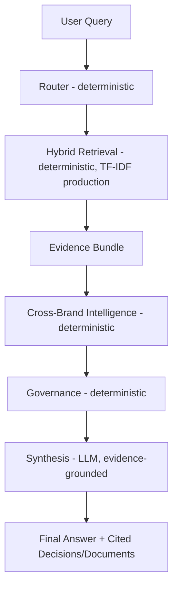

# Architecture — Think9 Decision Intelligence OS

## The Bottleneck This Solves

Think9 runs 30+ consumer brands, each making independent decisions on suppliers, product claims, and launch strategy. There is no existing mechanism for one brand to know what another brand has already learned. That knowledge either lives in someone's head, gets buried in old decks and Slack threads, or is never surfaced at all.

**Cost of the gap:** repeated supplier mistakes, re-approved claims that already caused issues elsewhere, launch strategies re-tried blind to prior cross-brand conflicts. This system collapses "has Think9 already learned this somewhere else?" from manual tribal-knowledge archaeology into a single query, answered in seconds, with cited evidence.

## Why This Is Not Generic RAG

1. **It reasons over structured decisions, not raw text.** Retrieval returns decision records (problem, options considered, decision made, outcome) — not just similar-sounding paragraphs.
2. **It is cross-brand by design.** The same retrieval layer spans all 30+ brands' decision history.
3. **It can say no.** When evidence is weak or conflicting, the system abstains or flags for human review rather than force a confident-sounding answer — enforced structurally, not just by prompt instruction.

## Design Principle: Deterministic Where Correctness Matters

**The LLM is used for language generation and nuanced synthesis — never for authoritative evidence selection or governance decisions.**

- **Router** — deterministic. Runs _after_ retrieval and classifies the retrieved decisions' business function for display and reasoning context (e.g. _"Routed as: legal — 2/4 of scored decisions above threshold are 'legal'"_). **Current limitation:** it does not filter or re-rank retrieval — it's a classification label, not a routing gate. See Known Limitations.
- **Hybrid Retriever** — deterministic. TF-IDF (production) / LSA (benchmarked, not yet live) scoring — same input always returns the same ranked results.
- **Cross-Brand Intelligence** — deterministic. Classifies retrieved evidence as clear precedent / conflicting / absent, using explicit rules over decision metadata (supplier, product line, outcome sentiment), not an LLM judgment call.
- **Governance** — deterministic. Three independent trigger rules (below), none overridable by the LLM.
- **Synthesis** — the only LLM step. Writes the final answer, constrained to evidence and classification decided upstream. The prompt includes the actual content of every document linked to a relevant decision — not just IDs — and explicitly forbids citing an ID that wasn't supplied, so citations are grounded rather than pattern-matched guesses.

**Why this split:** an LLM can hallucinate, be inconsistent across runs, or be persuaded by phrasing to soften a flag. None of those failure modes are acceptable for _whether a conflict was detected_ or _whether human review is required_. Those run as plain, tested Python. The LLM's job is narrower: given evidence and a classification already decided, write it up clearly and only cite what it was actually shown. If the LLM is unavailable, `template_fallback()` still produces a correct (if less fluent) answer — correctness never depends on the LLM being available or well-behaved.

## Pipeline



Actual `LangGraph` node order (`src/graph/pipeline.py`): `retrieve → route → cross_brand → governance → synthesize`. Governance runs _before_ synthesis, not after — its output (review-required flag and reasons) is passed into the synthesis prompt so the model's answer can reflect the review requirement directly, rather than governance being a post-hoc filter on LLM output.

| Stage                    | Type                                                        | Responsibility                                                                                           |
| ------------------------ | ----------------------------------------------------------- | -------------------------------------------------------------------------------------------------------- |
| Router                   | Deterministic                                               | Classifies retrieved decisions' function for display/context — not a retrieval filter (known limitation) |
| Hybrid Retriever         | Deterministic                                               | TF-IDF (production) / LSA (benchmarked) over decisions + documents                                       |
| Cross-Brand Intelligence | Deterministic                                               | Classifies precedent as clear / conflicting / absent across brands                                       |
| Governance               | Deterministic                                               | Flags human review; runs before synthesis so its output informs the answer                               |
| Synthesis                | LLM (Groq, `llama-3.3-70b-versatile → openai/gpt-oss-120b`) | Generates grounded final answer, citing only decision/document IDs it was actually given                 |

## Governance Rules

Three independent triggers, OR'd together:

1. **Evidence-level flag propagation** — if any retrieved decision was itself authored with `review_required=True`, that flag propagates (e.g. _"D05 is flagged review_required in its own record"_).
2. **High-stakes function** — decisions in `{"legal", "quality"}` trigger review regardless of the individual record's flag.
3. **Portfolio-relevant scope** — decisions with `scope="portfolio_relevant"` trigger review, independent of the other two rules.
4. **Cross-brand conflict** — handled as a separate `has_conflict` input to governance: if the Cross-Brand Intelligence agent detects differing outcomes for the same supplier/strategy across brands, review is triggered and no single verdict is forced.

All four are deterministic rule checks (`src/governance/rules.py`), covered by 10 unit tests (`tests/test_governance.py`) — no LLM involvement.

## Evidence Grounding

The synthesis prompt (`src/agents/synthesis_agent.py`, `_build_user_prompt`) includes:

- Relevant decision IDs, brand, function, problem, and outcome
- The actual content of every document (`doc.content`) linked to a relevant decision via `evidence_doc_ids`, not just its ID
- Conflicting pairs, if any
- Governance reasons, if review is required

The system prompt explicitly instructs the model to cite only IDs that appear in the supplied evidence, and to say so plainly rather than invent a citation when no document evidence exists for a claim. This closes a gap present in an earlier version of this file, where the prompt asked the model to cite document IDs without ever supplying their content — any such citation would have been a hallucination rather than grounded reading.

## Corpus

Synthetic MVP corpus, built in three layers:

- **18 structured decisions** — problem, options considered, decision made, reason, outcome, review flag, scope, brand/function/date
- **28 supporting unstructured documents** — realistic, noisy evidence, not stating conclusions outright
- **7 labeled evaluation queries** — spanning clear precedent, conflicting precedent, and no-precedent cases

5 fictional brands (Nova/Aura, Verve, Kindle, Lumen) and 3 suppliers (Alpha, Beta, Gamma).

## Evaluation

```bash
python eval/run_agent_eval.py    # full pipeline: agent behavior vs. ground truth
python eval/run_eval.py          # retrieval-only: recall@6, false-positive rate
python eval/run_comparision.py   # TF-IDF vs. LSA retrieval, head-to-head
```

### Full-pipeline agreement: 5/7

| Query | Expected                      | Got                           | Result      |
| ----- | ----------------------------- | ----------------------------- | ----------- |
| Q1    | surface_precedent_with_nuance | surface_precedent_with_nuance | ✅          |
| Q2    | surface_precedent_with_nuance | surface_precedent_with_nuance | ✅ (review) |
| Q3    | surface_precedent_with_nuance | surface_precedent_with_nuance | ✅ (review) |
| Q4    | no_precedent_found            | surface_precedent_with_nuance | ❌          |
| Q5    | no_precedent_found            | no_precedent_found            | ✅          |
| Q6    | no_precedent_found            | no_precedent_found            | ✅          |
| Q7    | conflict_flag_human_review    | surface_precedent_with_nuance | ❌          |

**Root cause, diagnosed to the exact layer and line:**

- **Q4 — retrieval failure.** Both TF-IDF and LSA flagged this as a false positive above threshold. Threshold/corpus-tuning issue, not a reasoning bug.
- **Q7 — cross-brand reasoning failure, not retrieval.** Retrieval succeeds on both embedders (`conflict_success=True` for both) — the correct conflicting decisions are found. The bug is in `src/agents/cross_brand_agent.py`: the conflict trigger requires the retrieved pair's outcome sentiment to be the _exact set_ `{"positive", "negative"}`. Outcome sentiment is derived from a small fixed keyword list with basic negation handling; when one side's outcome language doesn't cleanly match a keyword, it's classified `"mixed"` instead, and `{"negative", "mixed"}` never satisfies the strict-equality check — so a genuine conflict is missed. This is a general design flaw in the trigger condition, not a missing keyword, and is deliberately not patched with an ungeneralizable keyword tweak that would only make this one benchmark query pass. See roadmap for the principled fix.

### TF-IDF vs. LSA: a deliberate, evidence-backed choice

| Query | Type         | TF-IDF false positive | LSA false positive |
| ----- | ------------ | --------------------- | ------------------ |
| Q4    | no_precedent | True                  | True               |
| Q5    | no_precedent | **False**             | **True**           |
| Q6    | no_precedent | **False**             | **True**           |

Identical recall on genuine precedent cases (Q1–Q3). On the two genuine no-precedent cases, LSA produced a false positive on both while TF-IDF correctly abstained on both — LSA's latent-topic matching finds thematically-adjacent language and reports high confidence even where no real precedent exists.

**Decision: TF-IDF is the production default in the deployed app** (`apps/resources.py` builds the pipeline with `TextEmbedder` only). LSA remains implemented and benchmarked, not because it's inferior as a method — it's the more advanced one — but because it's measurably worse-calibrated for this system's specific correctness requirement at this corpus size. **Terminology note:** "semantic" retrieval here means LSA (TF-IDF → Truncated SVD), not a transformer-based sentence embedding — this sandbox's network blocks huggingface.co. See `src/ingestion/semantic_embed.py` for full rationale and the interface-compatible swap path to a real embedding model in production.

## Security

User-supplied query text can influence LLM output, which is rendered in the Streamlit UI via `unsafe_allow_html=True` for styling. All dynamic content (synthesized answer text, decision fields) is passed through `html.escape()` before interpolation, so LLM/user-influenced content cannot inject markup into the rendered page.

## What's Real MVP vs. Roadmap

**Real today:** full agentic pipeline (21 passing tests, all governance rules tested), TF-IDF and LSA retrieval both implemented and benchmarked head-to-head, deterministic governance (3 rules + conflict trigger), evidence-grounded LLM synthesis with a working non-LLM fallback, two-page UI with escaped output, reproducible eval harness with honestly-reported failures.

**Known limitations, precisely scoped:**

- Cross-brand conflict-classification trigger condition needs a general fix (Q7), root-caused above
- No-precedent threshold needs re-validation against a larger corpus (Q4)
- Router computes a function label but doesn't filter retrieval — no function-aware ranking exists yet
- Query context is free text only — no explicit current-brand/function fields
- Corpus is synthetic — real deployment requires ingesting Think9's actual decision history

Fixes and sequencing in [`30-day-roadmap.md`](30-day-roadmap.md).
